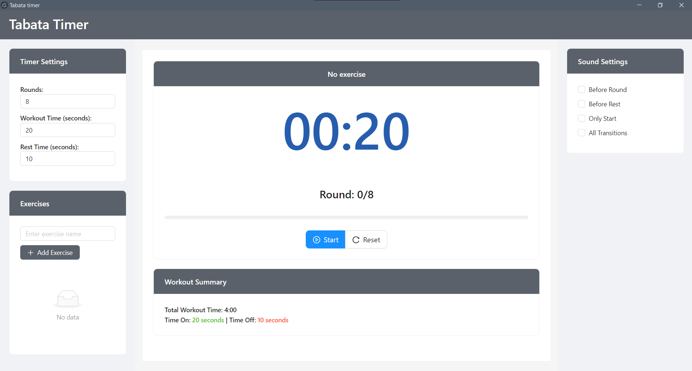

# Tabata Timer

The **Tabata Timer** is a simple, customizable workout timer built using React, Vite, and Electron. It allows users to time their high-intensity interval training (HIIT) exercises, particularly suited for Tabata-style workouts.

## Features

* **Customizable Interval Settings** : Set work time, rest time, and the number of rounds for your Tabata workout.
* **Visual and Audio Cues** : Visual progress bars and sound alerts keep you on track during your workout.
* **Electron-based Application** : Easily runs as a desktop app on various operating systems.
* **Lightweight and Fast** : Built with Vite for fast development and performance.

## Technologies Used

* **React** : JavaScript library for building the user interface.
* **Vite** : Build tool that provides fast, lightweight bundling and development.
* **Electron** : Framework for building cross-platform desktop apps.

## Installation

To run the project locally, follow these steps:

1. Clone the repository:
   `git clone https://github.com/your-username/tabata-timer.git`
2. Navigate into the project directory:
   `cd tabata-timer`
3. Install the dependencies:
   `npm install`
4. Start the development server:
   `npm run dev`
5. To build the Electron app for distribution:
   `npm run make`

## Usage

1. **Set Workout Parameters** : Customize the duration of your work periods, rest periods, and number of rounds.
2. **Start the Timer** : Begin your Tabata workout and follow the visual progress bar or listen for audio cues.
3. **Reset and Customize** : Reset and reconfigure the timer as needed between sessions.

## Contributing

If you wish to contribute:

1. Fork the repository.
2. Create a new branch for your feature or bug fix.
3. Submit a pull request.

## License

This project is licensed under the MIT License.
